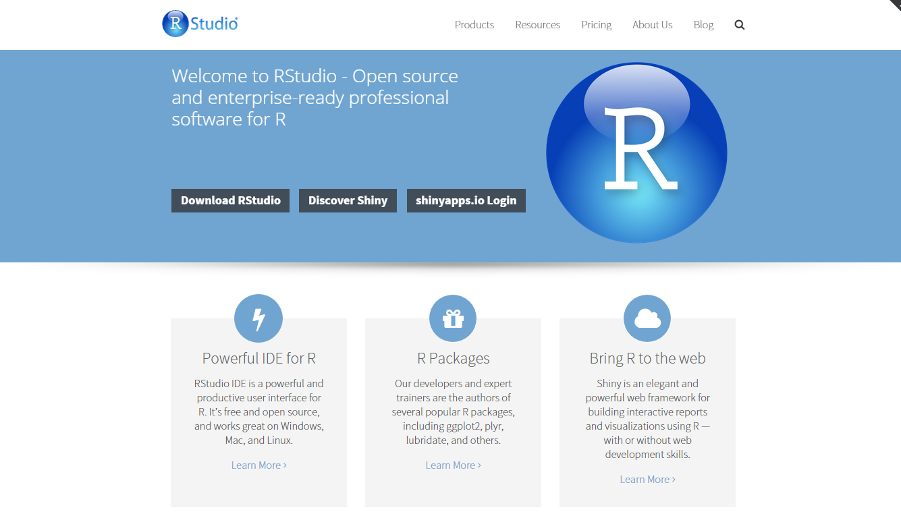

# Viewpoint

---

# Plan

main topic of course:

--

* Import Data

--

* Data Management
--

* Data Visualization

--

* Data Modeling

--

* Reporting

---

# Refrences

Practical Data Science with R 

---

# Refrences

R in Action Data Analysis and Graphics

---

# Refrences

R for Data Science: Import, Tidy, Transform, Visualize, and Model Data

---

# Refrences

Data Science in R 
A Case Studies Approach to Computational Reasoning and Problem Solving

---

# R Family

---

# Why R!

* The R language is widely used among statisticians for developing statistical software and data analysis.

--

* R was initially developed in early 90s by Robert Gentleman and Ross Ihaka at the Department of Statistics of the University of Auckland as a dialect of the S language.

--

* The R name is partly based on the (first) names of the first two R authors (Robert Gentleman and Ross Ihaka), and partly a play on the name of S.

---

# Compare languages

---

# History! 

* 1993: First announcement of R to the public.

--

* 1995: Martin Maechler convinces Ross Ihaka and Robert Gentleman to use the GNU General Public License to make R free software.

--

* 1997: The R Development Core Team is formed. The team controls the source code for R.

--

* 2000: R version 1.0.0 released. Developers considered R stable enough for production use.

--

* 2004: R version 2.0.0 released. Introduced lazy loading, which enables fast loading of data with minimal expense of system memory.

--

* 2013: R version 3.0.0 released. Introduced long vectors.

--

* 2018: R version 3.4.3 released.

---

# R advantages

* Fast and free.

--

* State of the art: Statistical researchers provide their methods as R packages. SPSS and SAS are years behind R!

--

* Excellent for graphics.

--

* Mx, WinBugs, and other programs use or will use R.

--

* Active user community.

--

* Excellent for simulation, programming, computer intensive analyses, etc.

--

* Forces you to think about your analysis.

--

* Interfaces with database storage software (SQL).

---

# R disadvantages

* Not user friendly at start: steep learning curve, minimal GUI.

--

* Sometimes, figuring out correct methods or how to use a function on your own can be frustrating.

--

* Easy to make mistakes and not know.

--

* Working with large datasets is limited by RAM.

--

* Data preparation and cleaning can be messier and more mistake prone in R vs SPSS or SAS.

---

# R Resources *

The CRAN contains:

--

* the software and packages;

--

* the search engine interface 

--

* the on-line documentation both in HTML and in PDF format. The HTML version can be accessed with the help.start() function within R;

--

* the R Journal. The R Journal is the open access, refereed journal of the R project. It features short to medium length articles covering topics that might be of interest to users or developers of R;

--

* the wiki, suggested books and many others.

.footnote[[*] https://cran.r-project.org/ ]

---

# Use R! * 

.footnote[[*] https://www.springer.com/series/6991 ]

---

# The R Series CRC Press press *

.footnote[[*] https://www.crcpress.com/Chapman--HallCRC-The-R-Series/book-series/CRCTHERSER ]

---

# Packt series *

.footnote[[*] https://www.packtpub.com/all ]

---

# Rstudio *

.footnote[[*] https://www.rstudio.com/ ]

---

# Github.com *

.footnote[[*] https://github.com/ ]

---

# R Bloggers *

.footnote[[*] http://www.r-bloggers.com/ ]

---

# RPubs *

.footnote[[*] http://rpubs.com/ ]

---

# Install R, RStudio, Rtools

RStudio is an integrated development environment (IDE) for R. It includes a console, syntax-highlighting editor that supports direct code execution, as well as tools for plotting, history, debugging and workspace management.

---

# How to Install

In order to run R and R-studio on your system, you need to follow the following three steps in the same order.

--

1. Install R

--

2. Install R-Studio

--

3. Install Rtools

--

4. Install R-Packages

---

# How to Install 

* Download the binary setup file for R from the following link. [install link](https://cran.r-project.org/)

--

* Install RStudio: On the following link [Download R Studio](http://www.rstudio.com/products/rstudio/download/) choose the appropriate installer file for your operating system, download it and then run it to install R-studio.

--

* [Install Rtools](https://cran.r-project.org/bin/windows/Rtools/): Rtools provides a toolchain for Windows platform that work well with R.

---

# awesome-r.com

.pull-left[
* Syntax

* Data Manipulation

* Graphic Displays

* HTML Widgets

* Reproducible Research

* Web Technologies and Services

* Parallel Computing

* High Performance

* Language API

* Database Management

* Machine Learning

]

.pull-right[

* Natural Language Processing

* Bayesian

* Optimization

* Finance

* Bioinformatics

* Network Analysis

* Spatial

* R Development

* Data Packages

* Other Tools

* Learning R
]

---

# Thank You for attention

